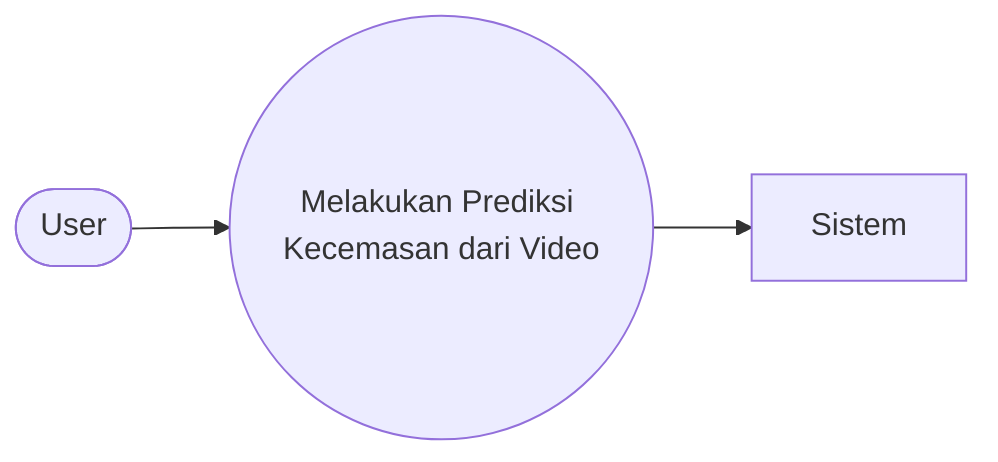
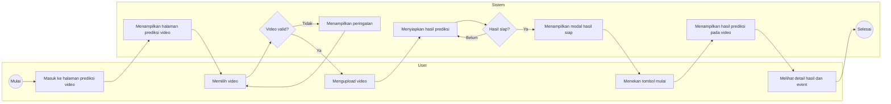

# Use Case Predict Video

Dokumen ini menjelaskan use case pada fitur **Predict Video**, yaitu fitur untuk mengunggah video wajah dan menampilkan hasil prediksi kecemasan berdasarkan video tersebut.

## Use Case Diagram

## Activity Diagram

## Rincian Use Case

| Atribut | Keterangan |
|---|---|
| Nama Use Case | Melakukan Prediksi Kecemasan dari Video |
| Aktor | User |
| Deskripsi | User mengunggah video wajah untuk diproses oleh sistem sehingga menghasilkan prediksi tingkat kecemasan. |
| Prekondisi | Aplikasi telah dibuka dan user berada pada halaman prediksi video. |
| Alur Utama | User memilih video → user mengupload video → sistem menyiapkan hasil prediksi → user menekan tombol mulai → sistem menampilkan hasil prediksi dan event pada video. |
| Alternatif | Jika file tidak valid atau upload gagal → sistem menampilkan peringatan. Jika pratinjau video tidak tersedia → video tetap dapat diupload dan dilihat pada halaman analisis. |
| Postkondisi | Hasil prediksi kecemasan, daftar event, dan chart analisis berhasil ditampilkan. |
